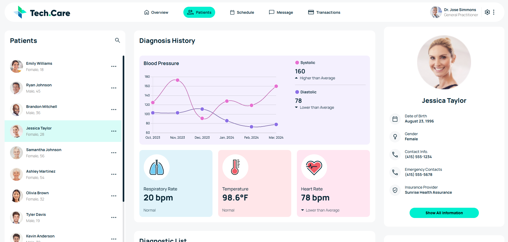
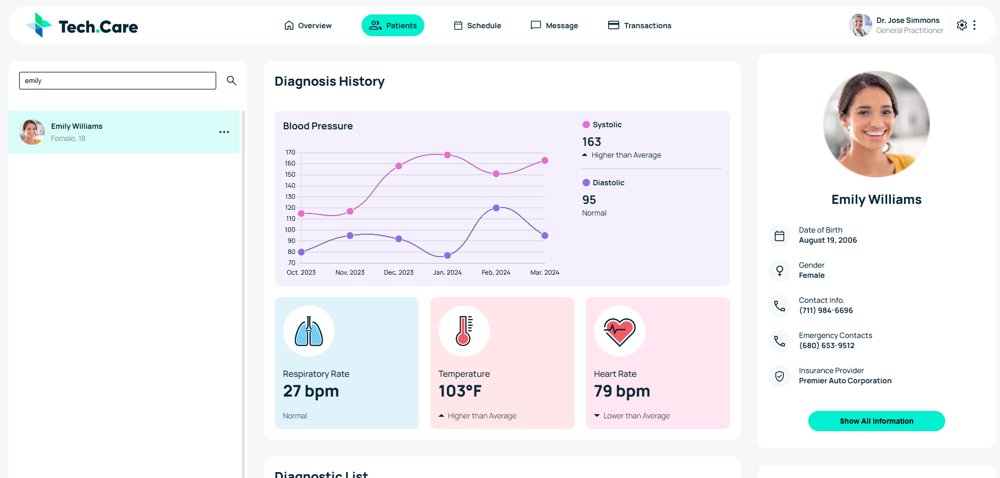

# Tech Care 🩺💊

This app showcases the details of the patients from an API, and also it plots the historic data of Blood Pressure on a chart for better understanding.
---

## Demo

You can checkout the project here : https://tech-care-three.vercel.app/

## Features ✨

- **Chart:** Better visuals and understanding from the chart.
- **Search:** Realtime search for patients.

---

## Screenshots 🌟

### Home Page


### Home Page (Search)


## Tech Stack 🛠️

- **Frontend:** React for interactive UI.

---

## Installation & Setup 🚀

1. Clone the repository:
   ```bash
   git clone https://github.com/VibekRoy/projectCare.git
   cd ProjectCare
   ```

2. Set up the frontend:
   ```bash
   npm install
   ```

5. Start the frontend:
   ```bash
   npm run dev
   ```
---

## Contributing 🤝

Contributions are welcome! Feel free to fork the repo and submit pull requests.  

---

## Contact 📬

For any queries, feel free to reach out:  
- **Author:** Vibek Roy  
- **Email:** vibekroy321@gmail.com
- **GitHub:** [VibekRoy](https://github.com/VibekRoy)
